<div align="center">


<br/>

[](https://accessmap-ai.vercel.app/)

<br/>

[](https://accessmap-ai.vercel.app/)
[](https://innospark-competition.devpost.com/)
[](https://ai.google.dev)
[](LICENSE)
[](https://nodejs.org)

<br/>

---


</div>

---

##  &nbsp;Demo

<div align="center">

> **Upload any photo → AI scans 847 ADA standards → Full compliance report in under 30 seconds**

[](https://accessmap-ai.vercel.app/annalyzer.html)

*Drop any photo of a parking lot, entrance, ramp, restroom, or corridor — real analysis begins immediately*

</div>

---

##  &nbsp;The Problem Found Us First

> **November 2024. A restaurant. A 2-inch gap that changed everything.**

My uncle has used a wheelchair his entire life. We tried to take him to a new restaurant downtown — one with great reviews, a packed Friday night, exactly the kind of place anyone would want to go.

**He couldn't get through the front door. It was 2 inches too narrow. The owner had no idea.**

That wasn't an isolated story. We started asking around. A physical therapist told us her clinic — a *medical office* — had an inaccessible bathroom for three years before anyone noticed. A restaurant owner had been sued twice and didn't know how to prevent it again. A gym owner paid a $5,000 consultant who took three weeks and left him with a PDF nobody read.

**The pattern was always the same:** businesses weren't malicious. They were uninformed, under-resourced, and had no practical tool to check. The law existed. The standards existed. What didn't exist was a way for an ordinary business owner to know — in real time, from their own phone — whether their space was putting someone in a wheelchair on the other side of a door they couldn't open.

<div align="center">

[](https://accessmap-ai.vercel.app/)

</div>

---

##  &nbsp;The Crisis in Numbers

### ADA Lawsuit Filings — 10 Year Surge

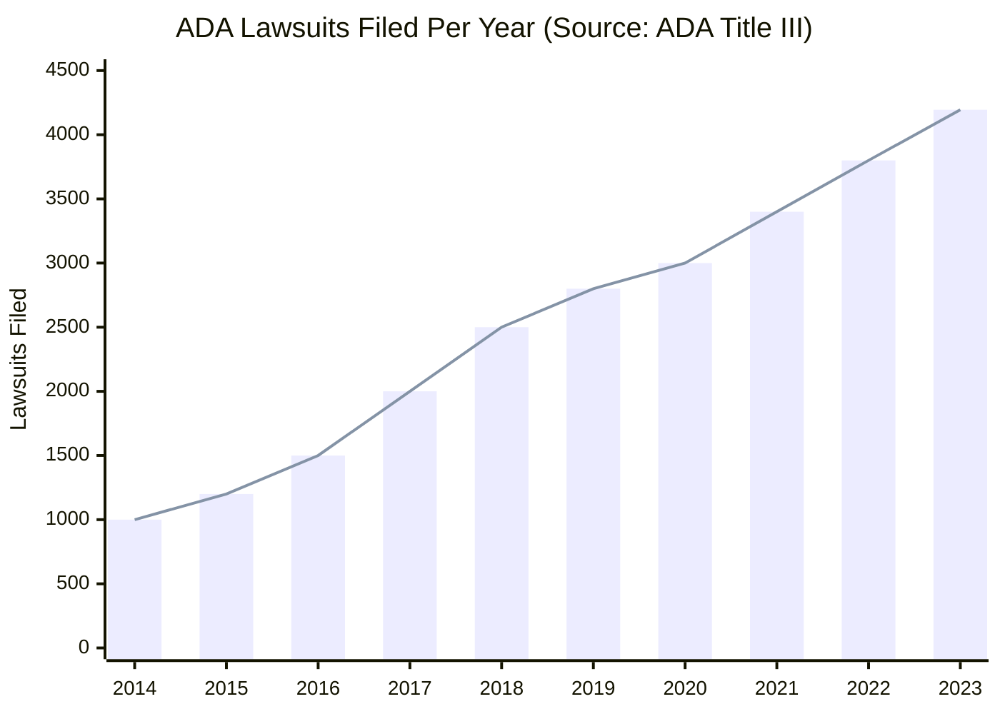

### Who Gets Sued

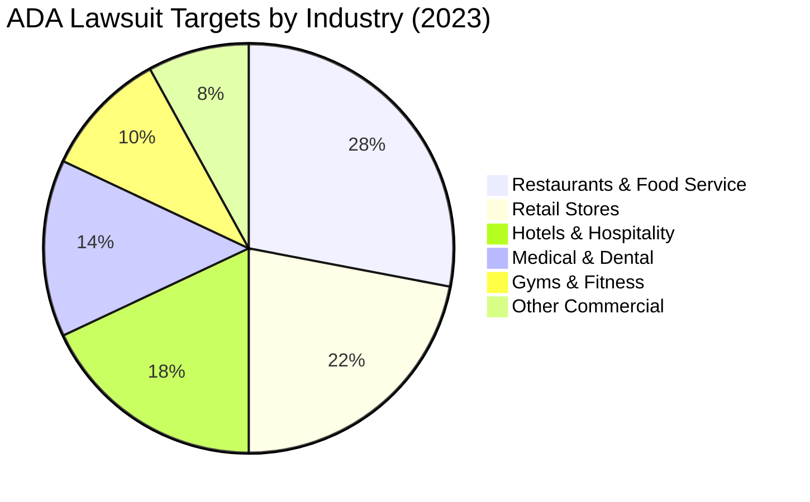

### Cost to Check Compliance

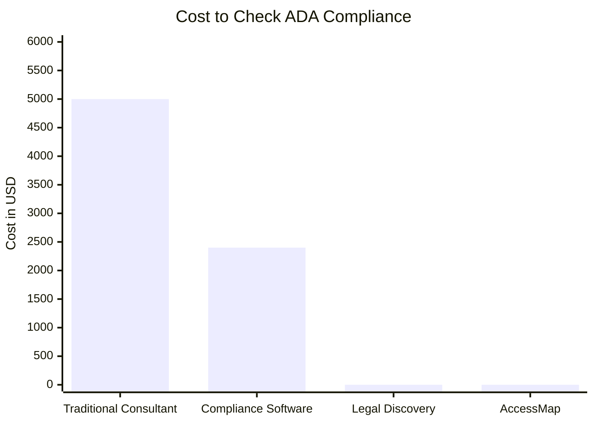

> AccessMap: **$0**. Always.

---

##  &nbsp;What Is AccessMap

**AccessMap is the first AI-powered visual ADA compliance scanner ever built.**

Upload a photo of any physical space. In under 30 seconds, Gemini Vision cross-references it against 847 federal ADA standards, flags every violation with exact legal citations, estimates remediation costs, scores your legal exposure from 0–100, and generates a step-by-step contractor fix guide.

No consultant. No site visit. No $5,000 invoice. **Just a photo.**

<div align="center">

| |  Traditional ADA Inspection |  AccessMap |
|:---:|:---:|:---:|
| **Cost** | $5,000 consultant fee | **$0** |
| **Time** | 3-week wait | **< 30 seconds** |
| **Output** | Generic PDF | **Scene-specific findings + exact ADA citations** |
| **Follow-up** | None | **AI chat — ask anything about your report** |
| **Remediation** | None | **Per-finding contractor brief, generated instantly** |
| **Scale** | One location | **Unlimited scans, any space, any device** |

</div>

---

##  &nbsp;Architecture — 3-Pass Gemini Pipeline

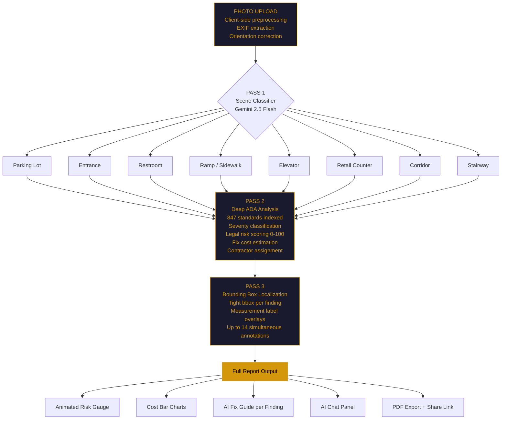

---

##  &nbsp;Severity Resolution Engine

The core of AccessMap's reliability is a **deterministic severity resolver** that overrides model output with ground-truth rules. Gemini can't soft-pedal a critical violation.

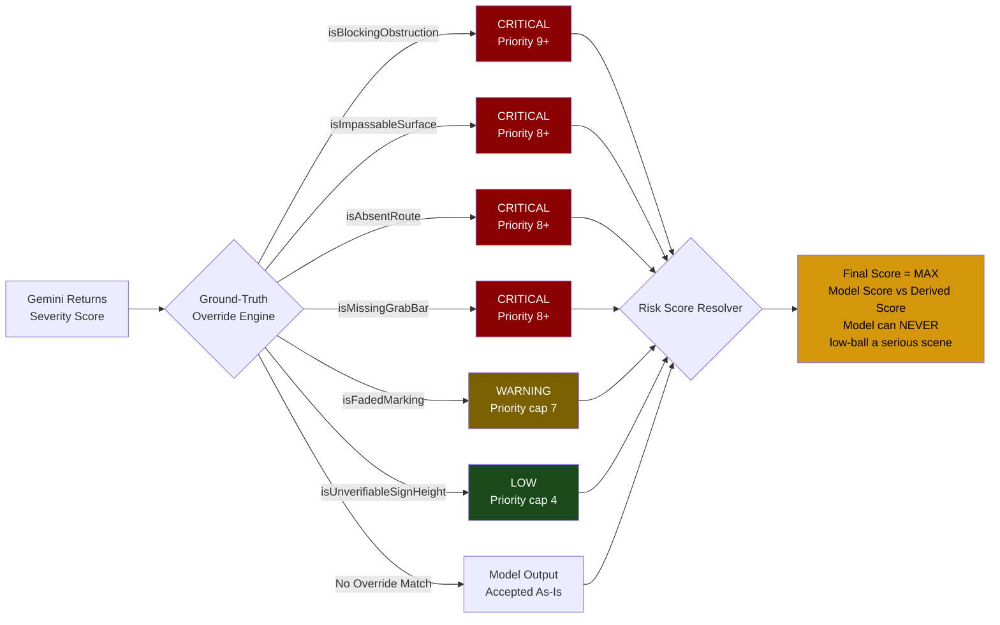

---

##  &nbsp;Scene-Specific ADA Checklists

Each scene type gets a dedicated checklist. No generic analysis. 8 scenes × ~12 checks = **96 targeted inspection points per photo**.

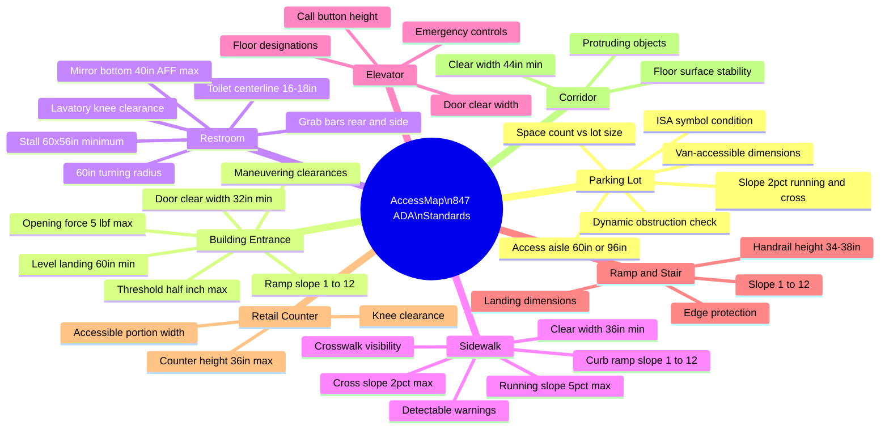

---

##  &nbsp;Feature Showcase

<div align="center">

| | Feature | What It Does |
|:---:|:---|:---|
|  | **3-Pass Gemini Pipeline** | Scene classify → Deep ADA analyze → Bounding box localize |
|  | **Scene-Aware Analysis** | 8 dedicated checklists — never a generic prompt |
|  | **Obstruction Detection** | Explicitly detects vehicles blocking accessible features |
|  | **Bounding Box Overlays** | Tight annotation boxes rendered directly on your photo |
|  | **AI Fix Guide** | Per-finding remediation: materials, steps, compliance checklist |
|  | **AI Chat Panel** | Ask about fines, DIY fixes, contractor briefs — full context |
|  | **Legal Risk Score** | 0–100 animated gauge calibrated to real violation severity |
|  | **Cost Visualization** | Animated bar charts per finding, total remediation range |
|  | **Camera Capture** | Scan directly from your device camera |
|  | **Fullscreen Overlay** | Inspect bounding boxes at full resolution |
|  | **PDF Export** | Printable report for contractor handoff |
|  | **Copy Per Finding** | Copy any violation card as plain text |
|  | **Share Links** | Shareable encoded report URL |

</div>

---

##  &nbsp;Market Opportunity

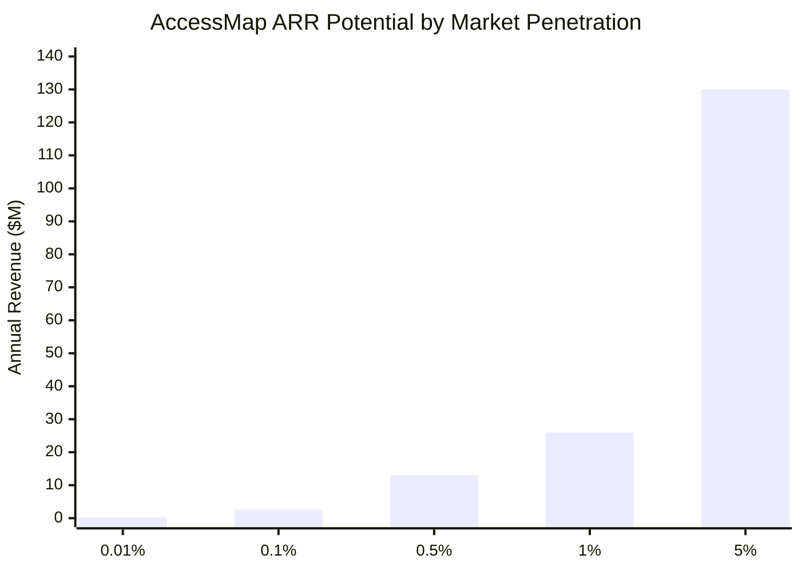

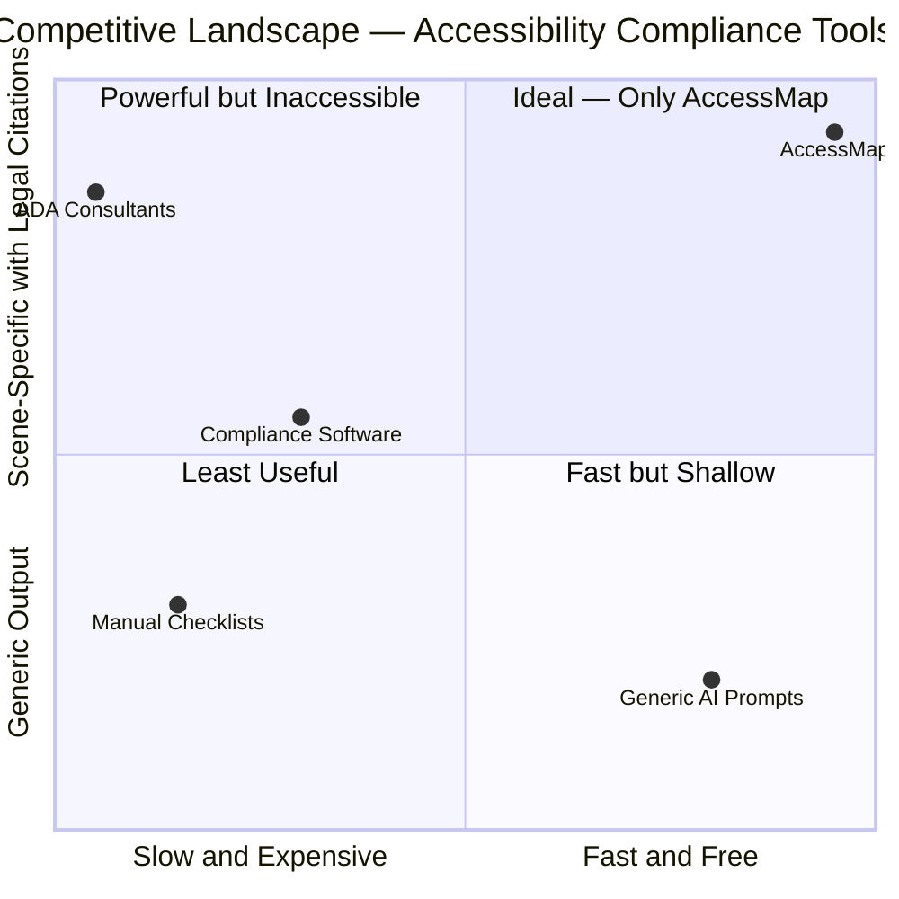

**Target customers:**

| | Segment | Notes |
|:---:|:---|:---|
|  | Restaurants & Food Service | Highest lawsuit exposure |
|  | Gyms & Fitness Studios | High foot traffic, complex layouts |
|  | Medical & Dental Offices | Federal compliance + patient access |
|  | Hotels & Hospitality | Multi-space complexity |
|  | Retail Stores | High volume, often overlooked |
|  | **Property Management Firms** | **Highest LTV — 50+ locations = $50K/yr** |
|  | Insurance Underwriters | White-label API opportunity |

---

##  &nbsp;Traction — Real World, Real Feedback

> *Not polished case studies. Not fake testimonials. Real conversations, real spaces.*

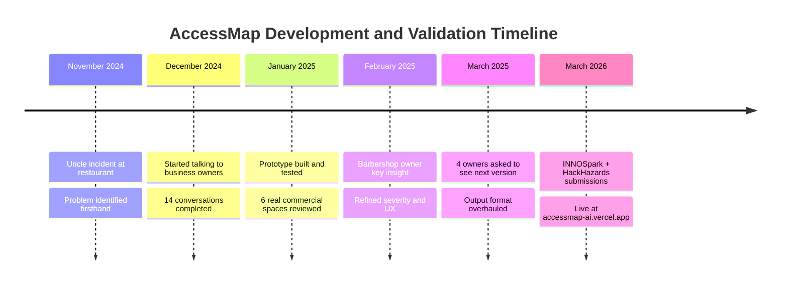

### Field Notes

<div align="center">

| | Business | Location | Quote | Signal |
|:---:|:---|:---|:---|:---:|
|  | Deli Owner | Queens | *"I thought once the contractor signed off, we were good."* |  Trusted bad info |
|  | Gym Owner | Brooklyn | *"Yeah, people mention that curb all the time."* |  Known issue, ignored |
|  | Property Manager | Jersey City | *"If something can tell me where the obvious risk is, that's useful."* |  Immediate value-add |
|  | Urgent Care Admin | Manhattan | *"I'd use this first so we're not wasting audit time on obvious stuff."* |  Replaces screening |
|  | Barbershop Owner | Bronx | *"Don't give me code sections first. Tell me what I need to fix."* |  Key UX insight |

</div>

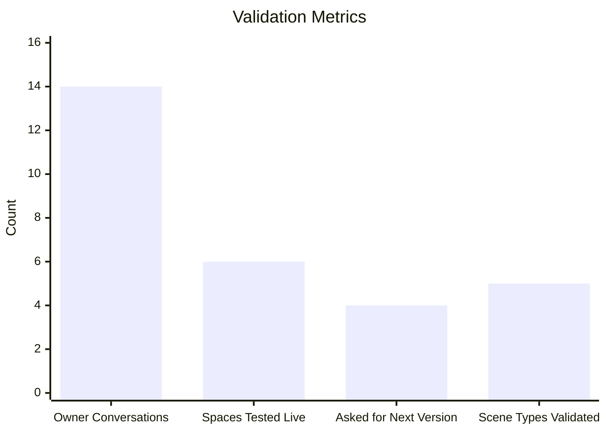

---

##  &nbsp;Revenue Model

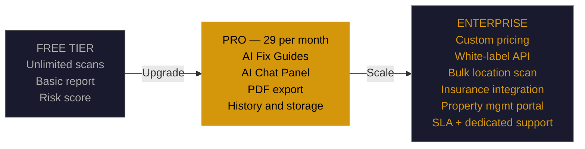

> **One property management firm managing 50 locations = $50,000/year contract.**
> Even 0.1% market penetration of 7.5M US commercial spaces = **$2.6M ARR**

---

##  &nbsp;API Reference

```
GET  /api/status    → { configured: bool, model: string }
POST /api/analyze   → Full analysis JSON
```

**POST /api/analyze payload:**
```json
{
  "mimeType": "image/jpeg",
  "imageBase64": "<base64>",
  "apiKey": "optional-browser-override",
  "isDemoMode": false
}
```

**Response shape:**
```json
{
  "summary": {
    "headline": "Critical ADA Violations Detected",
    "overview": "...",
    "immediateActions": ["...", "..."]
  },
  "report": {
    "riskScore": 90,
    "riskVerdict": "HIGH LEGAL EXPOSURE",
    "costSummary": { "low": 3000, "high": 9500, "display": "$3,000 - $9,500" }
  },
  "findings": [
    {
      "id": "F1",
      "type": "critical",
      "element": "Curb Ramp",
      "standard": "ADA 405.2, 302.1",
      "title": "Severely Damaged and Impassable Curb Ramp",
      "required": "Ramp surfaces shall be stable, firm, and slip resistant...",
      "detected": "Surface is broken, uneven, with multiple vertical changes...",
      "fixCost": "$2,500 - $7,500",
      "contractor": "Concrete/Paving Contractor",
      "timeline": "2-4 weeks",
      "priority": 9,
      "bbox": { "x": 15, "y": 45, "width": 60, "height": 40 }
    }
  ]
}
```

---

##  &nbsp;Project Structure

```
accessmap/
│
├── index.html          # Landing page — full marketing site
├── annalyzer.html      # Main analysis UI (3-step scan flow)
│
├── server.js           # Core pipeline
│   ├── Scene classifier    # Pass 1 — Gemini scene detection
│   ├── ADA analyzer        # Pass 2 — 847-standard deep scan
│   ├── BBox localizer      # Pass 3 — annotation coordinates
│   ├── Severity resolver   # Ground-truth override engine
│   ├── Risk scorer         # 0-100 legal exposure model
│   └── Static file server  # Zero-dependency HTTP server
│
├── package.json
└── .env                # API key (never committed)
```

**Zero runtime dependencies.** Node.js standard library only — no Express, no framework, no bloat. The entire server is a single `server.js` file.

---

##  &nbsp;Quick Start

**Requirements:** Node.js 18+, Gemini API key (free at [aistudio.google.com](https://aistudio.google.com))

```bash
# Clone
git clone https://github.com/Iceman-Dann/accessmap
cd accessmap

# Install
npm install

# Configure
echo "GEMINI_API_KEY=your_key_here" > .env

# Run
npm start
# Open http://127.0.0.1:3000
```

---

##  &nbsp;ADA Standards Coverage

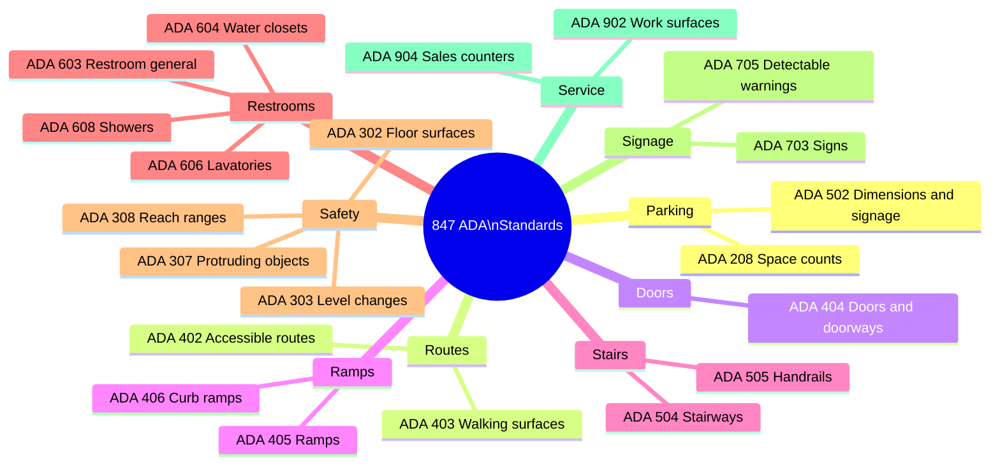

---

##  &nbsp;Tech Stack

<div align="center">


</div>

---

##  &nbsp;Social Impact

<div align="center">

| | Stat | Number | What It Means |
|:---:|:---|:---:|:---|
|  | Americans with disabilities | **61 million** | 1 in 4 adults. Every inaccessible door tells them they don't belong. |
|  | Annual spending power | **$490 billion** | Non-compliant businesses aren't just breaking the law — they're leaving money behind. |
|  | ADA suit growth over 10 years | **+320%** | Litigation is accelerating. Waiting for a complaint is no longer viable. |
|  | Commercial spaces unchecked | **7.5 million** | Invisible infrastructure no one has a practical way to check. |

</div>

---

##  &nbsp;License

MIT — see [LICENSE](LICENSE)

---

<div align="center">

[](https://accessmap-ai.vercel.app/)

<br/>

[](https://accessmap-ai.vercel.app/annalyzer.html)

<br/>

*Built with Gemini 2.5 Flash Vision · INNOSpark '26 · HackHazards '26*


</div>
